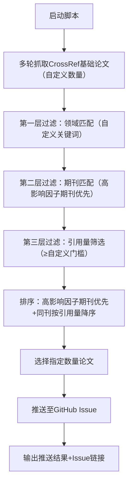

# DailyPapers———Your Research Assistant

自动抓取**任意领域**高引用、高影响因子期刊论文，并推送至 GitHub Issue 的通用型自动化脚本，全程无内置数据、无兜底假数据，所有论文均来自 CrossRef 公开学术 API，仅需修改配置即可切换抓取领域。

---

## ✨ 核心功能

| 序号 | 功能 | 说明 |
| --- | --- | --- |
| 1 | 通用领域适配 | 无固定领域限制，修改关键词即可抓取AI/机器学习/量子计算/生物医药等任意领域论文 |
| 2 | 高权威性筛选 | 优先选择高影响因子期刊（Nature/Science/IEEE顶刊/MDPI核心刊等）；可自定义引用量门槛，默认仅抓取引用量≥5 的高影响力论文 |
| 3 | 多轮扩大候选池 | 可自定义总抓取数量（默认3轮/300篇），大幅提升优质论文命中率，支持轮次延迟避免API限流 |
| 4 | 全自动推送 | 筛选完成后自动推送至指定 GitHub 仓库的 Issue，无需手动操作 |
| 5 | 多语言适配 | 支持多语言论文过滤（可选），覆盖国内外核心论文 |
| 6 | 丰富信息提取 | 自动提取论文标题、期刊、引用量、发表时间、作者、原文链接等核心信息 |

---

## 🛠 环境配置

### 1. 基础环境

| 项目 | 要求 |
| --- | --- |
| Python | 3.7+ |
| 依赖安装 | 见下方命令 |

```bash
pip install requests
# 如需统一管理依赖，可创建requirements.txt，内容仅需：requests
```

### 2. 配置文件修改（config.py）

修改 `config.py` 中的核心配置项，所有参数均为纯配置，无代码逻辑，修改关键词即可切换抓取领域。

**配置项说明表：**

| 配置项 | 说明 | 示例/默认值 |
| --- | --- | --- |
| `GITHUB_TOKEN` | GitHub 个人访问令牌（需开通 repo 权限） | `ghp_xxx...` |
| `REPO_OWNER` | GitHub 仓库所有者（用户名，区分大小写） | `AAA` |
| `REPO_NAME` | GitHub 仓库名称（区分大小写） | `xxx` |
| `PAPER_COUNT` | 最终推送的论文数量 | `5` |
| `TIME_RANGE_DAYS` | 抓取近 N 天发表的论文 | `500`（约 1 年半） |
| `MIN_CITATION_THRESHOLD` | 最低引用量门槛（过滤低影响力论文） | `5` |
| `TOTAL_CRAWL_COUNT` | 总抓取候选论文数（多轮拆分） | `300` |
| `CRAWL_BATCH_SIZE` | 每轮抓取数量 | `100` |
| `CRAWL_DELAY` | 轮次间延迟（避免API限流） | `1.5` |
| `SEARCH_KEYWORDS` | 自定义抓取领域关键词 | `machine learning`/`人工智能`/`量子计算` |
| `LANGUAGE_SCOPE` | 语言范围（en/zh，留空则不限） | `""`（留空） |
| `HIGH_IMPACT_JOURNALS` | 高影响因子期刊列表 | 覆盖Nature/Science/IEEE/MDPI等核心刊 |

---

## 🚀 使用步骤

| 步骤 | 操作 |
| --- | --- |
| 1 | 将 `config.py` 和 `main.py` 放在同一目录 |
| 2 | 修改 `config.py` 中的 `GITHUB_TOKEN`、`REPO_OWNER`、`REPO_NAME` 为自己的信息 |
| 3 | 修改 `config.py` 中的 `SEARCH_KEYWORDS` 为目标领域关键词（如`AI`/`生物医药`） |
| 4 | （可选）调整 `MIN_CITATION_THRESHOLD`、`TIME_RANGE_DAYS` 等参数 |
| 5 | 在项目目录下运行下方命令 |
| 6 | 运行成功后，在指定 GitHub 仓库的 Issue 中查看推送的高引用论文列表 |

**运行命令：**

```bash
python main.py
```

---

## 📌 核心逻辑流程



---

## ❓ 常见问题

| 问题 | 原因 | 解决方法 |
| --- | --- | --- |
| 抓取到 0 篇论文 | 引用量门槛过高，或时间范围过窄，或关键词过于小众 | 降低 `MIN_CITATION_THRESHOLD`（如改为 0），或扩大 `TIME_RANGE_DAYS`（如改为 730），或简化关键词 |
| 抓取失败（状态码400） | CrossRef API 无法解析错误的filter参数格式 | 确保 `LANGUAGE_SCOPE` 留空（避免格式错误），检查参数拼接无多余字符 |
| GitHub 推送失败（状态码401） | Token无效/权限不足/拼写错误，或仓库信息错误 | 1. 重新生成带`repo`权限的GitHub Token；2. 核对`REPO_OWNER`/`REPO_NAME`拼写（区分大小写） |
| GitHub 推送失败（状态码404） | 仓库不存在，或无访问权限 | 确认仓库地址正确，且当前账号有该仓库的Issue推送权限 |
| 轮次抓取中断 | API限流或网络超时 | 增大 `CRAWL_DELAY`（如改为2），或减少单轮抓取数量 `CRAWL_BATCH_SIZE` |

---

## 🎨 自定义扩展

| 扩展项 | 操作方式 |
| --- | --- |
| 切换抓取领域 | 修改 `config.py` 中的 `SEARCH_KEYWORDS` 为目标领域关键词（如`quantum computing`/`生物医药`） |
| 新增高影响期刊 | 在 `config.py` 的 `HIGH_IMPACT_JOURNALS` 列表中添加目标领域顶刊名称 |
| 调整抓取规模 | 修改 `TOTAL_CRAWL_COUNT`（总数量）或 `CRAWL_BATCH_SIZE`（单轮数量） |
| 开启语言过滤 | 在 `config.py` 中设置 `LANGUAGE_SCOPE = "en"`（仅英文）或 `"zh"`（仅中文） |
| 提取更多论文信息 | 在 `main.py` 的论文信息提取部分，新增字段（如摘要、DOI等） |

---

## 📄 免责声明

| 条款 | 内容 |
| --- | --- |
| 用途 | 本脚本仅用于学术研究，抓取的论文信息均来自 CrossRef 公开 API，请勿用于商业用途 |
| 版权 | 论文的版权归原期刊/作者所有，使用时请遵守相关学术规范 |
| 限流说明 | CrossRef API 为免费公开服务，请勿高频次抓取，建议单轮延迟≥1秒 |

---
