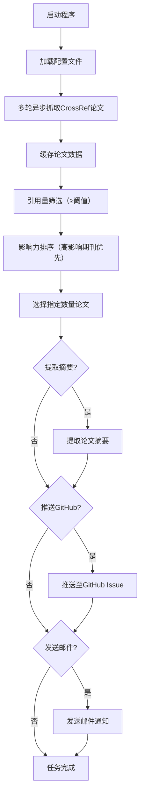

# DailyPapers - 智能学术论文助手

自动抓取**任意领域**高引用、高影响因子期刊论文，并推送至 GitHub Issue 或邮件的通用型自动化工具，全程无内置数据、无兜底假数据，所有论文均来自 CrossRef 公开学术 API，仅需修改配置即可切换抓取领域。

---

## ✨ 核心功能

| 序号 | 功能 | 说明 |
| --- | --- | --- |
| 1 | 通用领域适配 | 无固定领域限制，修改关键词即可抓取AI/机器学习/量子计算/生物医药等任意领域论文 |
| 2 | 高权威性筛选 | 优先选择高影响因子期刊（Nature/Science/IEEE顶刊/MDPI核心刊等）；可自定义引用量门槛，默认仅抓取引用量≥5 的高影响力论文 |
| 3 | 多轮扩大候选池 | 可自定义总抓取数量（默认3轮/300篇），大幅提升优质论文命中率，支持轮次延迟避免API限流 |
| 4 | 全自动推送 | 筛选完成后自动推送至指定 GitHub 仓库的 Issue，无需手动操作 |
| 5 | 邮件推送支持 | 可选配置邮件推送功能，将筛选结果直接发送到指定邮箱 |
| 6 | 摘要提取功能 | 支持自动提取论文摘要，提供更全面的论文信息 |
| 7 | 缓存机制 | 实现论文数据缓存，避免重复抓取，提高效率 |
| 8 | 多语言适配 | 支持多语言论文过滤（可选），覆盖国内外核心论文 |
| 9 | 丰富信息提取 | 自动提取论文标题、期刊、引用量、发表时间、作者、原文链接、DOI等核心信息 |

---

## 📁 项目结构

```
DailyPapers/
├── dailypapers/              # 核心包目录
│   ├── __init__.py           # 包初始化文件
│   ├── config.py             # 默认配置文件
│   ├── crawler.py            # 论文抓取模块（异步）
│   ├── extractor.py          # 摘要提取模块
│   ├── filter.py             # 论文筛选模块
│   ├── main.py               # 主程序入口
│   ├── pusher.py             # 推送模块（GitHub/邮件）
│   └── utils.py              # 工具函数
├── .gitignore                # Git忽略文件
├── README.md                 # 项目说明文档
├── config_uav.py             # UAV领域配置文件
├── main_uav.py               # UAV领域主程序
├── requirements.txt          # 依赖文件
├── run.py                    # 运行脚本
├── setup.py                  # 安装配置
├── test.py                   # 测试文件
└── test_engineering.py       # 工程测试文件
```

---

## 🛠 环境配置

### 1. 基础环境

| 项目 | 要求 |
| --- | --- |
| Python | 3.7+ |
| 依赖包 | 见下方安装命令 |

```bash
# 安装依赖
pip install -r requirements.txt

# 或手动安装
pip install requests aiohttp
```

### 2. 配置文件修改

修改 `dailypapers/config.py` 中的核心配置项，所有参数均为纯配置，无代码逻辑，修改关键词即可切换抓取领域。

**核心配置项说明：**

| 配置项 | 说明 | 示例/默认值 |
| --- | --- | --- |
| `GITHUB_TOKEN` | GitHub 个人访问令牌（需开通 repo 权限） | `ghp_xxx...` |
| `REPO_OWNER` | GitHub 仓库所有者（用户名，区分大小写） | `LeoLiao0806Xuan` |
| `REPO_NAME` | GitHub 仓库名称（区分大小写） | `UAVs` |
| `PAPER_COUNT` | 最终推送的论文数量 | `5` |
| `TIME_RANGE_DAYS` | 抓取近 N 天发表的论文 | `500`（约 1 年半） |
| `MIN_CITATION_THRESHOLD` | 最低引用量门槛（过滤低影响力论文） | `5` |
| `TOTAL_CRAWL_COUNT` | 总抓取候选论文数（多轮拆分） | `300` |
| `CRAWL_BATCH_SIZE` | 每轮抓取数量 | `100` |
| `CRAWL_DELAY` | 轮次间延迟（避免API限流） | `1.5` |
| `SEARCH_KEYWORDS` | 自定义抓取领域关键词 | `machine learning`/`人工智能`/`量子计算` |
| `LANGUAGE_SCOPE` | 语言范围（en/zh，留空则不限） | `""`（留空） |
| `HIGH_IMPACT_JOURNALS` | 高影响因子期刊列表 | 覆盖Nature/Science/IEEE/MDPI等核心刊 |
| `SMTP_CONFIG` | 邮件发送配置（可选） | 包含SMTP服务器、端口、邮箱账号等 |

---

## 🚀 使用步骤

### 基本使用

1. **配置 GitHub 信息**：修改 `dailypapers/config.py` 中的 `GITHUB_TOKEN`、`REPO_OWNER`、`REPO_NAME` 为自己的信息
2. **设置抓取领域**：修改 `SEARCH_KEYWORDS` 为目标领域关键词（如 `AI`/`生物医药`/`quantum computing`）
3. **调整筛选参数**：根据需要调整 `MIN_CITATION_THRESHOLD`、`TIME_RANGE_DAYS` 等参数
4. **运行程序**：在项目目录下执行以下命令

```bash
# 运行默认配置
python -m dailypapers.main

# 或使用 run.py
python run.py
```

### 高级使用（命令行参数）

```bash
# 基本运行
python -m dailypapers.main

# 不推送至GitHub
python -m dailypapers.main --no-github

# 提取论文摘要
python -m dailypapers.main --extract-abstracts

# 发送邮件通知
python -m dailypapers.main --email your-email@example.com

# 使用自定义配置文件
python -m dailypapers.main --config custom_config

# 组合使用
python -m dailypapers.main --extract-abstracts --email your-email@example.com
```

---

## 📌 核心流程


```mermaid
flowchart TD
    A[启动程序] --> B[加载配置文件]
    B --> C[多轮异步抓取CrossRef论文]
    C --> D[缓存论文数据]
    D --> E[引用量筛选（≥阈值）]
    E --> F[影响力排序（高影响期刊优先）]
    F --> G[选择指定数量论文]
    G --> H{提取摘要?}
    H -->|是| I[提取论文摘要]
    H -->|否| J{推送GitHub?}
    I --> J
    J -->|是| K[推送至GitHub Issue]
    J -->|否| L{发送邮件?}
    K --> L
    L -->|是| M[发送邮件通知]
    L -->|否| N[任务完成]
    M --> N
```

---

## 🎨 自定义扩展

| 扩展项 | 操作方式 |
| --- | --- |
| 切换抓取领域 | 修改 `config.py` 中的 `SEARCH_KEYWORDS` 为目标领域关键词 |
| 新增高影响期刊 | 在 `config.py` 的 `HIGH_IMPACT_JOURNALS` 列表中添加目标领域顶刊名称 |
| 调整抓取规模 | 修改 `TOTAL_CRAWL_COUNT`（总数量）或 `CRAWL_BATCH_SIZE`（单轮数量） |
| 开启语言过滤 | 在 `config.py` 中设置 `LANGUAGE_SCOPE = "en"`（仅英文）或 `"zh"`（仅中文） |
| 配置邮件推送 | 完善 `SMTP_CONFIG` 配置，运行时添加 `--email` 参数 |
| 提取摘要 | 运行时添加 `--extract-abstracts` 参数 |
| 禁用GitHub推送 | 运行时添加 `--no-github` 参数 |
| 使用自定义配置 | 创建自定义配置文件，运行时添加 `--config` 参数 |

---

## ❓ 常见问题

| 问题 | 原因 | 解决方法 |
| --- | --- | --- |
| 抓取到 0 篇论文 | 引用量门槛过高，或时间范围过窄，或关键词过于小众 | 降低 `MIN_CITATION_THRESHOLD`（如改为 0），或扩大 `TIME_RANGE_DAYS`（如改为 730），或简化关键词 |
| 抓取失败（状态码400） | CrossRef API 无法解析错误的filter参数格式 | 确保 `LANGUAGE_SCOPE` 留空（避免格式错误），检查参数拼接无多余字符 |
| GitHub 推送失败（状态码401） | Token无效/权限不足/拼写错误，或仓库信息错误 | 1. 重新生成带`repo`权限的GitHub Token；2. 核对`REPO_OWNER`/`REPO_NAME`拼写（区分大小写） |
| GitHub 推送失败（状态码404） | 仓库不存在，或无访问权限 | 确认仓库地址正确，且当前账号有该仓库的Issue推送权限 |
| 轮次抓取中断 | API限流或网络超时 | 增大 `CRAWL_DELAY`（如改为2），或减少单轮抓取数量 `CRAWL_BATCH_SIZE` |
| 邮件发送失败 | SMTP配置错误或网络问题 | 检查 `SMTP_CONFIG` 配置是否正确，确保邮箱开启了SMTP服务 |

---

## 📄 免责声明

| 条款 | 内容 |
| --- | --- |
| 用途 | 本工具仅用于学术研究，抓取的论文信息均来自 CrossRef 公开 API，请勿用于商业用途 |
| 版权 | 论文的版权归原期刊/作者所有，使用时请遵守相关学术规范 |
| 限流说明 | CrossRef API 为免费公开服务，请勿高频次抓取，建议单轮延迟≥1秒 |
| 责任 | 使用本工具产生的任何问题，由使用者自行承担，与工具开发者无关 |

---

## 🤝 贡献

欢迎提交 Issue 和 Pull Request 来改进这个项目！

---

## 📞 联系

如果您有任何问题或建议，请通过 GitHub Issue 与我们联系。

---

**最后更新时间：** 2026-03-01